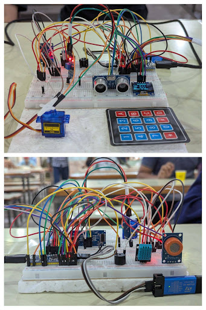
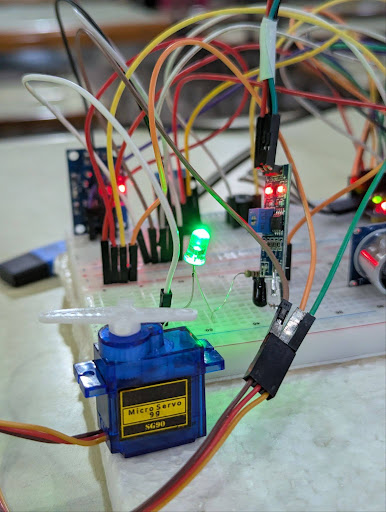
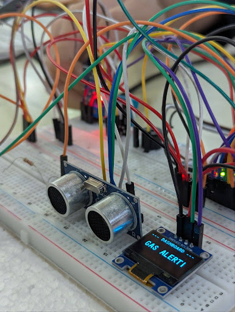
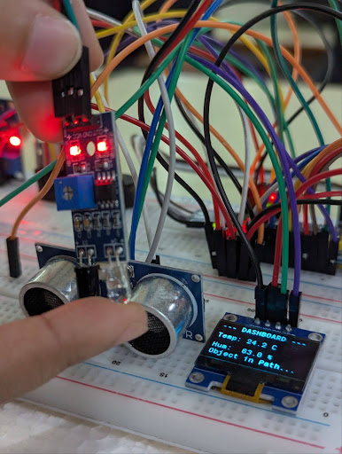

# 🏠 Home Automation & Safety System

> An embedded system project built on the **STM32F103C8T6 (Blue Pill)** microcontroller that integrates multiple sensors for real-time home safety monitoring, environmental tracking, and secure access control.

---

## 📋 Table of Contents

- [Overview](#overview)
- [Features](#features)
- [Hardware Components](#hardware-components)
- [System Workflow](#system-workflow)
- [Project Screenshots](#project-screenshots)
- [Project Structure](#project-structure)
- [Getting Started](#getting-started)
- [Build & Flash Instructions](#build--flash-instructions)
- [Known Limitations](#known-limitations)
- [Future Improvements](#future-improvements)
- [Team](#team)

---

## Overview

Traditional home safety systems operate independently and cannot respond actively to arising threats. This project bridges that gap by integrating multiple sensors under a single STM32 microcontroller — providing gas leak detection, environmental monitoring, distance-based obstacle detection, IR-based object detection, and password-secured door control, all displayed on a compact OLED dashboard.

---

## Features

### Password-Based Door Lock
- The HC-SR04 ultrasonic sensor monitors a 10 cm zone in front of the door
- If an object/person is detected **within 10 cm**, the OLED prompts **"Enter Password"**
- The user enters a 4-digit code via the 4×4 keypad
- **Correct password** → Servo motor rotates **90°** (unlocked) + Green LED turns ON
- When the object moves **out of range**, the servo rotates back to **0°** and the LED turns OFF
- If no object is detected, the OLED shows a standby/welcome message

### Temperature & Humidity Monitoring
- After successful authentication, the OLED continuously displays real-time **temperature** and **humidity** readings from the DHT11 sensor

### Gas Leakage Detection
- The MQ-2 sensor continuously monitors air quality
- If gas concentration exceeds **1500 ppm**, the **buzzer activates** and the OLED displays **"GAS ALERT!!"**
- The alert persists until gas levels drop below the threshold

### IR-Based Object Detection
- The IR sensor detects nearby objects via infrared reflection
- When an object is detected, the OLED shows **"Object In Path"**

### OLED Dashboard
The SSD1306 OLED display cycles through states based on sensor inputs:

| State | Display |
|-------|---------|
| Standby | Welcome / system idle message |
| Object in ultrasonic range | "Enter Password" + keypad input |
| Authenticated | Live Temp & Humidity readings |
| Gas detected (>1500 ppm) | "GAS ALERT!!" |
| IR object detected | "Object In Path" |

---

## Hardware Components

| Component | Role |
|-----------|------|
| STM32F103C8T6 (Blue Pill) | Central microcontroller |
| ST-Link V2 | Programming & debugging |
| DHT11 | Temperature & humidity sensing |
| MQ-2 Gas Sensor | Gas/smoke detection |
| HC-SR04 Ultrasonic Sensor | Distance measurement & proximity detection |
| IR Sensor | Object/obstacle detection |
| SG90 Servo Motor | Door lock mechanism (simulated) |
| SSD1306 OLED Display | System status dashboard |
| 4×4 Matrix Keypad | Password input |
| Green LED | Access granted indicator |
| Buzzer | Gas alert warning |
| 220Ω Resistor | LED current protection |

---

## System Workflow

```
Power ON
   │
   ▼
[OLED: Standby Message]
   │
   ├──► HC-SR04 detects object ≤ 10cm?
   │         │ YES
   │         ▼
   │    [OLED: "Enter Password"]
   │         │
   │    Keypad input received
   │         │
   │    ┌────┴────┐
   │  Correct?   Wrong?
   │    │           └──► Stay on password screen
   │    ▼
   │  Servo → 90° | Green LED ON
   │    │
   │  Object leaves range?
   │    │ YES
   │    ▼
   │  Servo → 0° | Green LED OFF
   │    │
   │    ▼
   ├──► [OLED: Live Temp & Humidity from DHT11]
   │
   ├──► MQ-2 gas value > 1500 ppm?
   │         │ YES
   │         ▼
   │    Buzzer ON | [OLED: "GAS ALERT!!"]
   │    (clears when gas level drops)
   │
   └──► IR sensor detects object?
             │ YES
             ▼
        [OLED: "Object In Path"]
```

---

## Project Screenshots

### Complete Hardware Setup

<p align="center">
  
</p>

> Full breadboard implementation including the STM32 Blue Pill, keypad, servo motor, OLED display, all sensors, and jumper wire connections.

---

### Password Entry & Door Lock

<p align="center">
  
  
</p>

> *Left:* OLED showing the "Enter Password" prompt with hidden input characters while the user types via keypad.  
> *Right:* Servo motor rotating to the unlocked position with the green LED ON after correct password entry.

---

### Gas Leakage Warning

<p align="center">
  
</p>

> OLED displaying "GAS ALERT!!" when MQ-2 detects gas concentration above the 1500 ppm threshold.

---

### Environment Monitoring & IR Detection

<p align="center">
  
</p>

> *Left:* OLED showing live temperature, humidity, and object detection status from DHT11 and HC-SR04 and at bottom showing the message "Object in Path" which detect by the IR sensor

---

## Project Structure

```
project_home_safety_2/
│
├── assets/                           # Project images for README
│   ├── hardware-setup.jpg
│   ├── password-entry.jpg
│   ├── gas-alert.jpg
│   ├── environment-monitor.jpg
│   ├── ir-detection.jpg
│   └── servo-door.jpg
│
├── Core/
│   ├── Inc/                          # Header files (.h)
│   └── Src/                          # Source files (.c) — main logic here
│
├── Drivers/                          # STM32 HAL & CMSIS drivers (auto-generated)
│
├── MDK-ARM/
│   ├── DebugConfig/
│   ├── project_home_safety_2/
│   ├── RTE/
│   ├── startup_stm32f103xb.s         # Startup assembly file
│   ├── project_home_safety_2.uvprojx  Main Keil project file
│   ├── project_home_safety_2.uvoptx
│   └── project_home_safety_2.uvguix.Hp
│
├── .mxproject
└── project_home_safety_2.ioc         # STM32CubeMX pin configuration file
```

> 💡 **Tip:** The `.ioc` file can be opened with **STM32CubeMX** to visually reconfigure GPIO pins and regenerate HAL initialization code.

---

## Getting Started

### Prerequisites

- [Keil MDK-ARM (µVision)](https://www.keil.com/download/product/) with ARM Compiler **V6.24**
- [STM32CubeMX](https://www.st.com/en/development-tools/stm32cubemx.html) *(optional, for pin reconfiguration)*
- ST-Link V2 driver installed
- STM32F103C8T6 Blue Pill board

### Hardware Setup

1. Connect all sensors and peripherals as per the pin configuration in `Core/Inc/` header files
2. Connect the ST-Link V2 to the Blue Pill's SWD pins (SWDIO, SWDCLK, GND, 3.3V)
3. Ensure the **BOOT0 jumper** is set to **0** (normal run mode) for regular operation

---

## Build & Flash Instructions

1. **Open the project** — double-click `MDK-ARM/project_home_safety_2.uvprojx` to open in Keil µVision
2. **Configure build settings:**
   - Go to **Options for Target**
   - Under **Target** tab → ARM Compiler: **V6.24**
   - Under **Output** tab → Check **Create HEX File**
3. **Build the project** — click the **Build** icon or press `F7`
4. **Flash to the board:**
   - Connect the STM32 Blue Pill via ST-Link
   - Ensure the **BOOT0 yellow jumper is on position 0** (write/run mode)
   - Click **LOAD** in Keil to flash the compiled `.hex` file
5. **Reset** the board after flashing — the system will boot and begin running

> ⚠️ **Note:** The MQ-2 sensor requires a warm-up period before providing accurate readings. Allow 30–60 seconds after power-on for stable gas detection values.

> ⚠️ **Note:** The stored password is hardcoded in program memory. There is currently no runtime password change functionality due to the absence of persistent memory on the Blue Pill.

---


## Team

**Course:** CSE331 — Microprocessor Interfacing and Embedded Systems  
**Section:** 3 | **Semester:** Spring 2026  
**Institution:** North South University

| Name | Contribution |
|------|--------------|
| Mohammed Arif Mainuddin | Obstacle Detection (HC-SR04), Password System |
| Najifa Tabassum         | Servo Motor Door Lock, IR Sensor Detection |
| Moontaha Rawshan        | Gas Leakage Detection (MQ-2), Password System |
| Md. Ishzaz Asif Rafid   | Temperature & Humidity (DHT11), OLED Dashboard |

**Faculty:** Md. Raqibur Rahman (RQN)  
**Lab Instructor:** Md Abdullah Al Sayed

---

*Built with  using STM32, HAL drivers, and a lot of jumper wires.*
